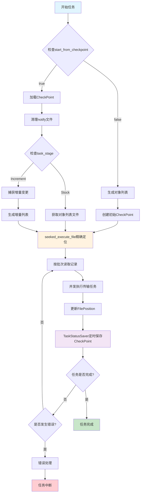
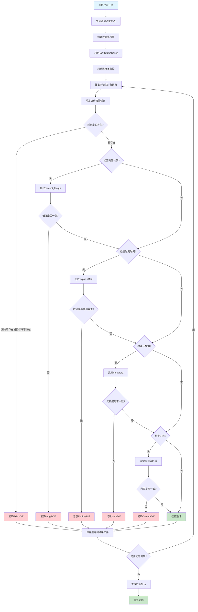

# 设计与实现机制


## 断点续传实现机制

### 核心设计思想

断点续传机制基于**CheckPoint**和**FilePosition**两个核心概念，通过精确记录文件执行位置和任务状态，实现任务中断后的精确恢复。

### 关键数据结构

#### 1. CheckPoint 结构体
```rust
pub struct CheckPoint {
    pub task_id: String,                        // 任务 ID
    pub executed_file: FileDescription,         // 当前执行的文件描述
    pub executed_file_position: FilePosition,   // 文件执行位置
    pub file_for_notify: Option<String>,        // 通知文件路径
    pub task_stage: TaskStage,                  // 任务阶段 (Stock/Increment)
    pub modify_checkpoint_timestamp: i128,      // 检查点修改时间戳
    pub task_begin_timestamp: i128,             // 任务开始时间戳
}
```

#### 2. FilePosition 结构体
```rust
pub struct FilePosition {
    pub file_num: i32,    // 文件编号
    pub offset: usize,    // 文件字节偏移量
    pub line_num: u64,    // 行号
}
```

#### 3. FileDescription 结构体
```rust
pub struct FileDescription {
    pub path: String,      // 文件路径
    pub size: u64,         // 文件大小
    pub total_lines: u64,  // 总行数
}
```

### 实现流程详解

#### 1. 检查点创建与保存

**TaskStatusSaver** 负责定期保存任务状态：
- 监控多个并发任务的执行进度
- 通过 `DashMap<String, FilePosition>` 记录各任务的文件位置
- 定时计算最小偏移量作为安全检查点
- 将检查点信息序列化为 YAML 文件保存

```
任务执行 -> 记录FilePosition -> 计算最小offset -> 保存CheckPoint
```

#### 2. 断点恢复流程

当 `start_from_checkpoint = true` 时：

1. **加载检查点**：从 `checkpoint_transfer.yml` 读取上次执行状态
2. **清理环境**：删除 meta 目录下的 notify 文件
3. **根据任务阶段恢复**：
   - **Stock 阶段**：从检查点记录的文件位置继续执行
   - **Increment 阶段**：基于时间戳捕获增量变更

#### 3. 文件位置精确定位

**seeked_execute_file()** 方法实现精确定位：
```rust
pub fn seeked_execute_file(&self) -> Result<File> {
    let mut file = File::open(&self.executed_file.path)?;
    let seek_offset = TryInto::<u64>::try_into(self.executed_file_position.offset)?;
    file.seek(SeekFrom::Start(seek_offset))?;
    Ok(file)
}
```

#### 4. 多文件处理机制

系统支持处理多个对象列表文件：
- 通过 `sequence_file` 记录文件列表顺序
- 使用 `file_num` 标识当前处理的文件
- 支持跨文件的断点续传

#### 5. 并发安全保障

- 使用 `Arc<AtomicBool>` 实现停止标记的原子操作
- 通过 `Arc<DashMap>` 实现线程安全的状态共享
- 信号量控制并发度，避免资源竞争

### 断点续传执行流程图



### 增量任务的断点续传

对于增量任务，断点续传机制更加复杂：

1. **时间戳基准**：使用 `task_begin_timestamp` 作为增量扫描的起始时间
2. **变更捕获**：调用 `changed_object_capture_based_target()` 获取变更对象
3. **状态切换**：任务阶段从 `Stock` 切换到 `Increment`
4. **持续监控**：支持多轮增量执行的断点续传

### 技术优势

1. **精确性**：字节级别的位置记录，确保不丢失、不重复
2. **可靠性**：多层错误处理和状态验证机制
3. **性能优化**：批量处理和并发控制，减少磁盘 I/O
4. **灵活性**：支持全量和增量任务的统一断点续传

### 使用场景

- **大规模文件迁移**：TB 级数据传输的中断恢复
- **网络不稳定环境**：自动处理网络中断和重连
- **长时间运行任务**：支持任务暂停和恢复
- **增量同步**：持续的数据同步任务

## 增量实现机制

### 源为 OSS 的增量实现机制

- scan 方式

* 遍历 object
* 筛选 lastmodify 时间戳大于前次同步开始时间戳的 object
* 同步 objcet
* 循环以上步骤
  
### 源为文件系统的增量实现机制

#### 源为文件系统

* notify 监控要同步的目录
* 生成增量文件
* 读取文件并执行增量任务，并记录文件 offset
* 当 offset 为文件长度时，中断增量任务
* 定时检查文件长度，当文件长度增长时从 offset 读取文件执行同步动作，知道 offset 与文件长度相当。循环执行该步骤

#### 源为 oss

* 通过本地存量列表与源对比生成已删除的对象列表
* 通过执行上次操作的其实时间戳遍历源端生成增量对象列表

## 错误处理机制
v
* 出错既停，人工介入


## 校验机制

### 核心设计思想

校验机制基于**多维度对比**和**差异检测**的设计理念，通过对源端和目标端对象的多个维度进行精确比较，确保数据传输的完整性和一致性。系统支持存在性校验、内容长度校验、内容校验、过期时间校验和元数据校验等多种校验类型。

### 关键数据结构

#### 1. ObjectDiff 结构体
```rust
pub struct ObjectDiff {
    pub source: String,        // 源对象路径
    pub target: String,        // 目标对象路径
    pub diff: Diff,           // 差异类型
}
```

#### 2. Diff 枚举类型
```rust
pub enum Diff {
    ExistsDiff(DiffExists),      // 存在性差异
    LengthDiff(DiffLength),      // 长度差异
    ExpiresDiff(DiffExpires),    // 过期时间差异
    ContentDiff(DiffContent),    // 内容差异
    MetaDiff(DiffMeta),          // 元数据差异
}
```

#### 3. CompareCheckOption 配置
```rust
pub struct CompareCheckOption {
    check_content_length: bool,  // 是否检查内容长度
    check_expires: bool,         // 是否检查过期时间
    check_content: bool,         // 是否检查内容
    check_meta_data: bool,       // 是否检查元数据
}
```

### 校验类型详解

#### 1. 存在性校验 (ExistsDiff)
- **目的**：检查源端和目标端对象是否都存在
- **实现**：分别检查源端和目标端对象的存在状态
- **差异记录**：记录源端和目标端的存在状态布尔值

#### 2. 内容长度校验 (LengthDiff)
- **目的**：比较源端和目标端对象的文件大小
- **实现**：获取两端对象的 content_length 进行比较
- **差异记录**：记录源端和目标端的具体字节长度

#### 3. 内容校验 (ContentDiff)
- **目的**：逐字节比较源端和目标端对象的实际内容
- **实现**：
  - 使用 1MB 缓冲区分块读取对象内容
  - 逐字节比较，发现差异立即记录位置和字节值
  - 支持大文件的流式比较，避免内存溢出
- **差异记录**：记录差异位置、源端字节值、目标端字节值

#### 4. 过期时间校验 (ExpiresDiff)
- **目的**：比较对象的过期时间设置
- **实现**：解析 expires_string 字段，转换为 DateTime 结构进行比较
- **差异记录**：记录源端和目标端的过期时间戳
- **容差机制**：支持配置时间差异容忍范围 (exprirs_diff_scope)

#### 5. 元数据校验 (MetaDiff)
- **目的**：比较对象的自定义元数据
- **实现**：比较 metadata 字段的键值对
- **差异记录**：记录源端和目标端的完整元数据映射

### 校验架构设计

#### 1. 抽象接口层
- **CompareTaskActions**：定义校验任务的抽象接口
  - `gen_source_object_list_multi_files()`: 生成源端对象列表
  - `gen_compare_executor()`: 创建校验执行器

- **CompareExecutor**：定义校验执行器的抽象接口
  - `compare_listed_records()`: 批量校验对象记录
  - `error_occur()`: 错误处理机制

#### 2. 具体实现层
支持四种存储组合的校验实现：
- **TaskCompareLocal2Local**: 本地到本地校验
- **TaskCompareLocal2Oss**: 本地到 OSS 校验
- **TaskCompareOss2Local**: OSS 到本地校验
- **TaskCompareOss2Oss**: OSS 到 OSS 校验

### 校验执行流程



### 并发安全机制

#### 1. 原子操作控制
- 使用 `Arc<AtomicBool>` 实现停止标记和错误标记
- 保证多线程环境下状态的原子性更新

#### 2. 线程安全的状态共享
- 使用 `Arc<DashMap>` 实现线程安全的偏移量映射
- 支持并发读写操作，避免锁竞争

#### 3. 信号量控制
- 通过 `Arc<Semaphore>` 控制并发度
- 防止过多并发任务导致资源耗尽

### 错误处理机制

#### 1. 分层错误处理
- **网络错误**：区分 NoSuchKey 和其他服务错误
- **文件系统错误**：处理文件不存在、权限不足等问题
- **数据格式错误**：处理时间戳解析、元数据格式等问题

#### 2. 错误恢复策略
- **出错即停**：发现错误立即停止任务，避免错误扩散
- **错误记录**：详细记录错误信息，便于问题排查
- **状态保存**：保存当前执行状态，支持错误修复后继续执行

### 结果输出机制

#### 1. 差异文件生成
- 按批次生成差异结果文件，文件名包含偏移量信息
- 使用 JSON 格式记录差异详情，便于后续处理
- 空文件自动删除，减少磁盘占用

#### 2. 校验报告
- 统计各类差异的数量和分布
- 生成表格化的校验报告
- 支持按差异类型分类展示

### 性能优化策略

#### 1. 批量处理
- 按配置的批次大小处理对象，减少任务创建开销
- 支持可配置的批次大小，适应不同场景需求

#### 2. 流式处理
- 大文件内容比较采用流式处理，避免内存溢出
- 使用固定大小缓冲区，平衡内存使用和性能

#### 3. 早期退出
- 发现第一个差异即停止该对象的后续校验
- 减少不必要的计算和网络传输

### 使用场景

- **数据迁移验证**：确保迁移后数据的完整性和一致性
- **定期数据校验**：定期检查存储系统中数据的一致性
- **灾备验证**：验证备份数据与源数据的一致性
- **合规性检查**：满足数据完整性的合规要求

### 大文件分片机制
#### 生成分片计划

- 本地文件：通过函数 pub fn gen_file_part_plan(file_path: &str, chunk_size: usize) -> Result<Vec<FilePart>>  按照 chunk_size 进行分片，输出  
  ```
  pub struct FilePart {
      /// 分片号
      pub part_num: i32,
      /// 分片在文件中的偏移量
      pub offset: u64,
  }
  ```
  part_num 从 1 开始，便于与 s3 分片机制统一、pub offset 文件分片 offset 的开始位置
- 对象存储 object：通过函数 pub fn gen_object_part_plan_from_head(get_object_output: &HeadObjectOutput, chunk_size: usize) -> Result<Vec<ObjectRange>>  按照 chunk_size 进行分片，输出 
  ```
  
  pub struct ObjectRange {
      /// 分片号
      pub part_num: i32,
      /// 分片起始位置
      pub begin: usize,
      /// 分片结束位置
      pub end: usize,
  }
  ```
#### 按分片传输

